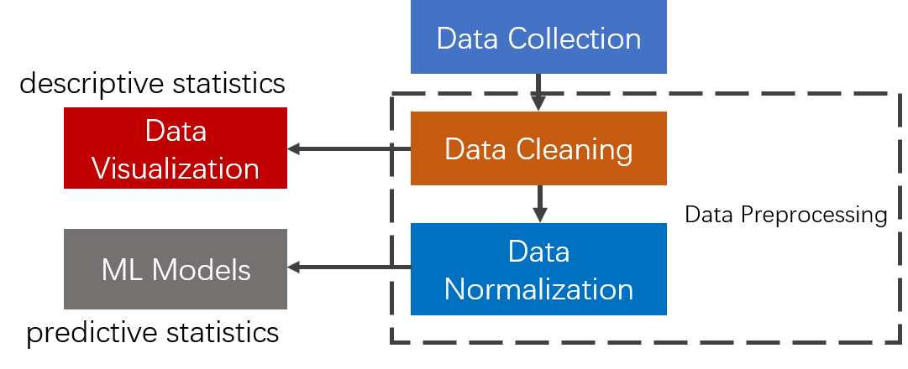
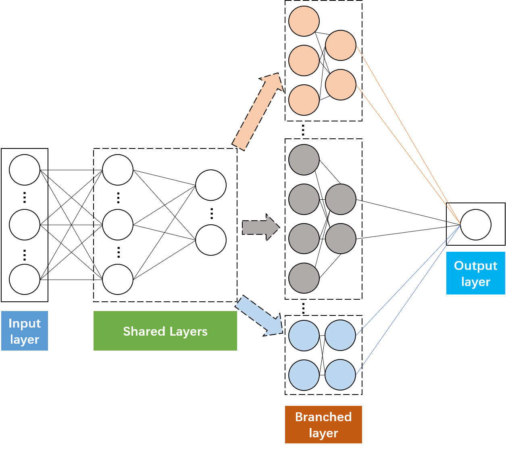

# Data-driven Approach for Quality Evaluation on Knowledge Sharing Platform

## Introduction
Knowledge sharing plays a significant role in knowledge acquisition for ordinary people,
however, due to the insufficient evaluation schemes, people suffer from lots of low-level
knowledge services, which overwhelm the platform as well.

In our paper, we propose a data-driven method to automatically predict a Zhihu Live's
score. 

## Methods





## Experimental Results
| Model | MAE | RMSE |   
| :---: | :---: | :---: | 
| Linear Regression | 0.2366 | 0.3229 |
| KNN Regression | 0.2401 | 0.3275 |
| SVR (RBF) | 0.2252 | 0.3270 |
| SVR (Linear) | 0.2257 | 0.3267 |
| SVR (Poly) | 0.2255 | 0.3268 |
| Random Forest Regressor | 0.2267 | 0.3244 |
| MLP | 0.2397 | 0.3276 |
| **MTNet** | **0.2250** | **0.3216** |


## Resource
* [ZhiHuLiveDB](./spider/ZhihuLiveDB.xlsx) 
* [pretrained MTNet](./analysis/model/ZhihuLive_MTNet.pth)
* [Zhihu Live Comments](https://drive.google.com/file/d/1MbezeRjCy5NUkrP2p8KzHqO66fNVANue/view?usp=sharing)

## Note
For deeper analysis, please read my article at [Zhihu](https://zhuanlan.zhihu.com/p/30514792).
More details will be illustrated in our paper: 

```Data-driven Approach for Quality Evaluation on Knowledge Sharing Platform.```